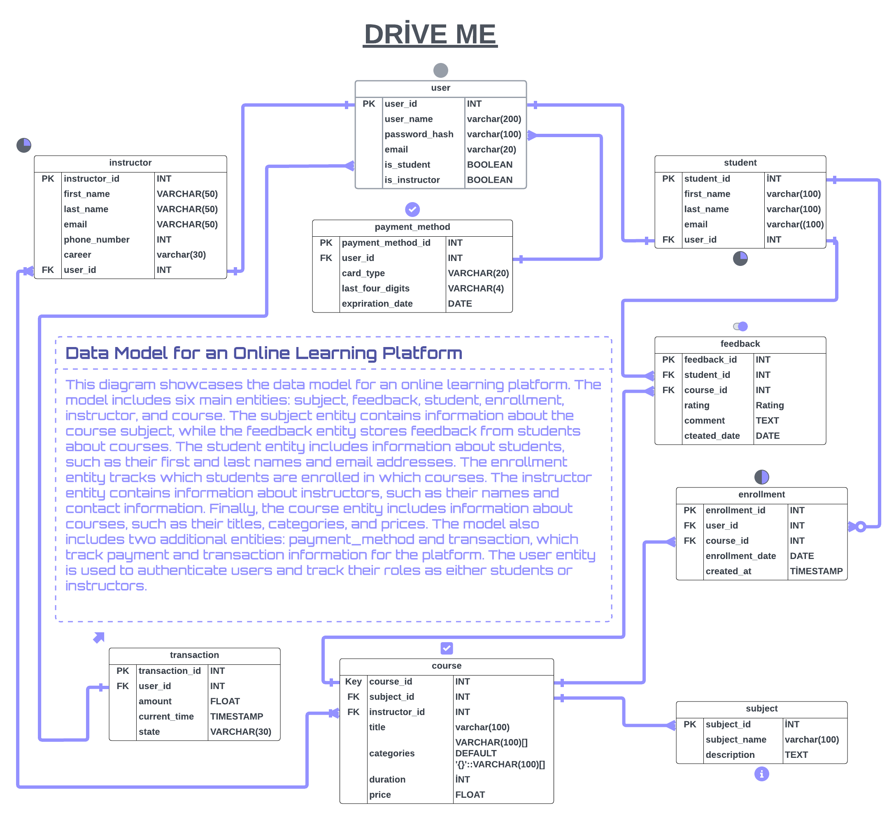

Certainly! Below is a sample "README" text that you can include in your project. Remember to customize it with specific details about your project, such as installation instructions, usage guidelines, and any other relevant information.

---

# Courses Platform

**Created By:** Al-Edrisy

## Overview

The Courses Platform is an online learning platform designed to connect instructors and students, providing a seamless environment for course creation, enrollment, and feedback.


## Features

- **User Management:** Register and manage both instructors and students.
- **Course Creation:** Instructors can create and manage courses.
- **Enrollment:** Students can enroll in courses.
- **Feedback:** Students can provide feedback on courses.
- **Payment Integration:** Handle payments for course transactions.

## Installation

1. Clone the repository:

    ```bash
    git clone https://github.com/Al-Edrisy/Course-Platform-Database.git
    ```

2. Navigate to the project directory:

    ```bash
    cd courses-platform-Database
    ```

3. Install dependencies:

    ```bash
    npm install
    ```

4. Set up the database:

    ```bash
    npm run setup-database
    ```

5. Start the application:

    ```bash
    npm start
    ```

## Database Setup

The project uses PostgreSQL as the database. Ensure you have PostgreSQL installed and update the database configuration in `config/database.js` accordingly.

## Usage

- Access the platform through the provided URL.
- Register as an instructor or student.
- Explore courses, enroll in them, and provide feedback.
- Instructors can create and manage courses.

## Contributing

Contributions are welcome! If you find any issues or have suggestions for improvements, please open an issue or submit a pull request.

## License

This project is licensed under the [MasterCodeHub] Created By Al-Edrisy.

---
